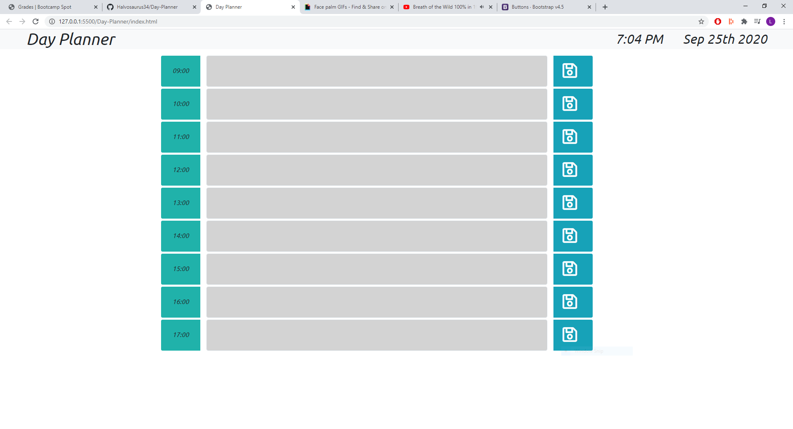

# Day-Planner

# Description
We were asked to create a day planner website that includes the date and time, hour slots between 9am and 5pm. You can write in the text boxes and press the save button to save to local storage. The colors will change depending on what time it is. grey = in the past, green = present, light salmon = future.
## Issues
The primary issue for this project was trying to check if the time was greater than, equal to or less than each of the time slots.
## Collaborators
With instruction from Fil and Daniel.
___
[Filipe Laborde-Basto's](https://github.com/c0dehot) GitHub.
___
[Daniel Cabellos](https://github.com/shibeknight) GitHub.
___
## Links

___
[GitHub Repository](https://github.com/Halvosaurus34/Day-Planner)
___
[My Day Planner](https://halvosaurus34.github.io/Day-Planner/index.html)
___
______
